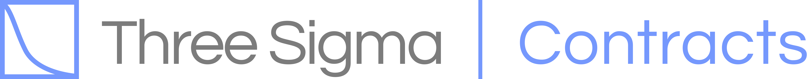

# 


**A library to aid in smart contract development using foundry.** 

 * Implementation of Test Helpers like [MerkleTreeTestHelpers](https://github.com/threesigmaxyz/threesigma-contracts/contracts/foundry-test-helpers/MerkleTreeTestHelper.sol)


## Installation

```console
$ forge install threesigmaxyz/threesigma-contracts
```

## Usage

Once installed, the remapping variable must be set in the foundry.toml file. Alternatively, this variable can be stored in a remappings.txt file in the project's root.

```
@threesigma=lib/threesigma-contracts
```

Instructions can be found in the [official foundry book](https://book.getfoundry.sh/projects/dependencies.html).


After installing and setting the remapping variable, it is possible to use the contracts in the library by importing as follows:

```solidity
pragma solidity ^0.8.15;

import "@threesigma/contracts/foundry-test-helpers/MerkleTreeTestHelper.sol";

contract MyCollectible is MerkleTreeTestHelper {
    function setUp() {
        setMerkleTree("addresses.txt");
    }
}
```

## Learn More
Docs are still under construction


## Contacts
### [Website](https://threesigma.xyz/) [Twitter](https://twitter.com/threesigma_xyz) [Medium](https://medium.com/@threesigma_xyz)


## License

Three Sigma contracts are released under the [MIT License](LICENSE).